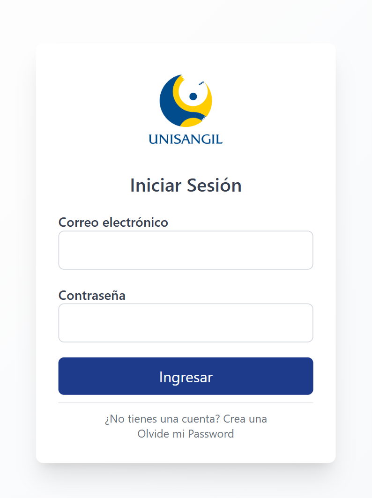
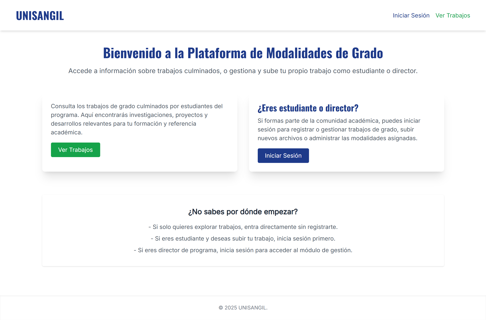
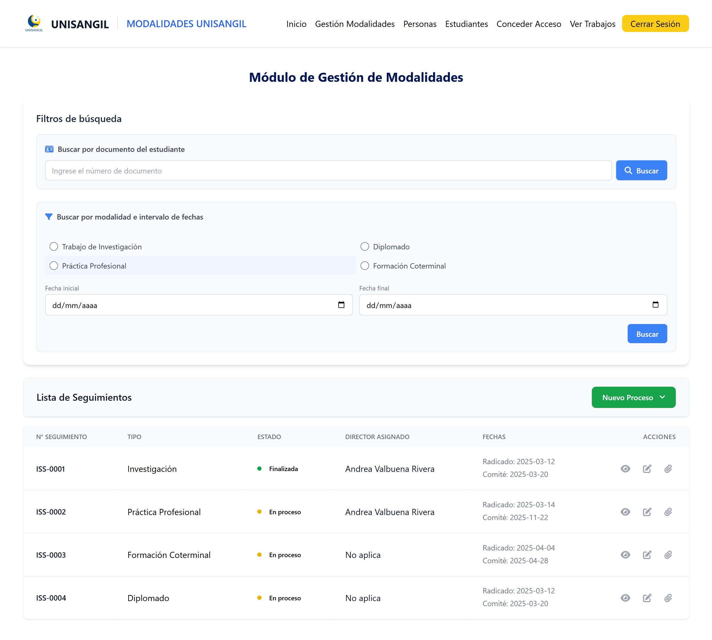
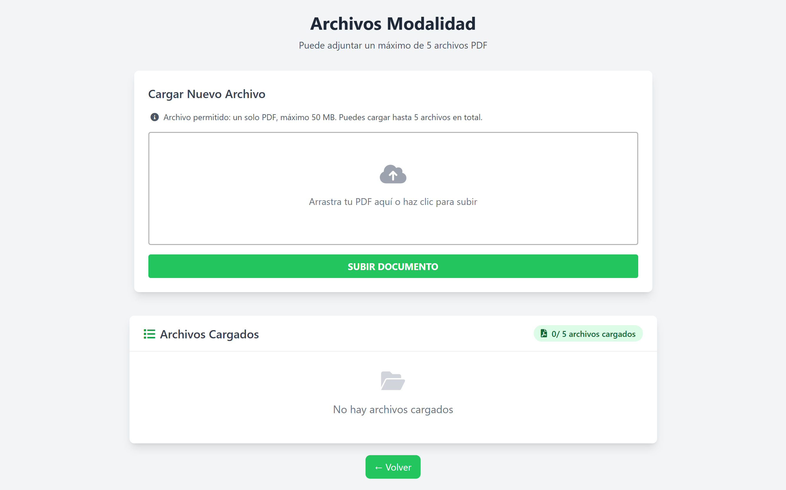
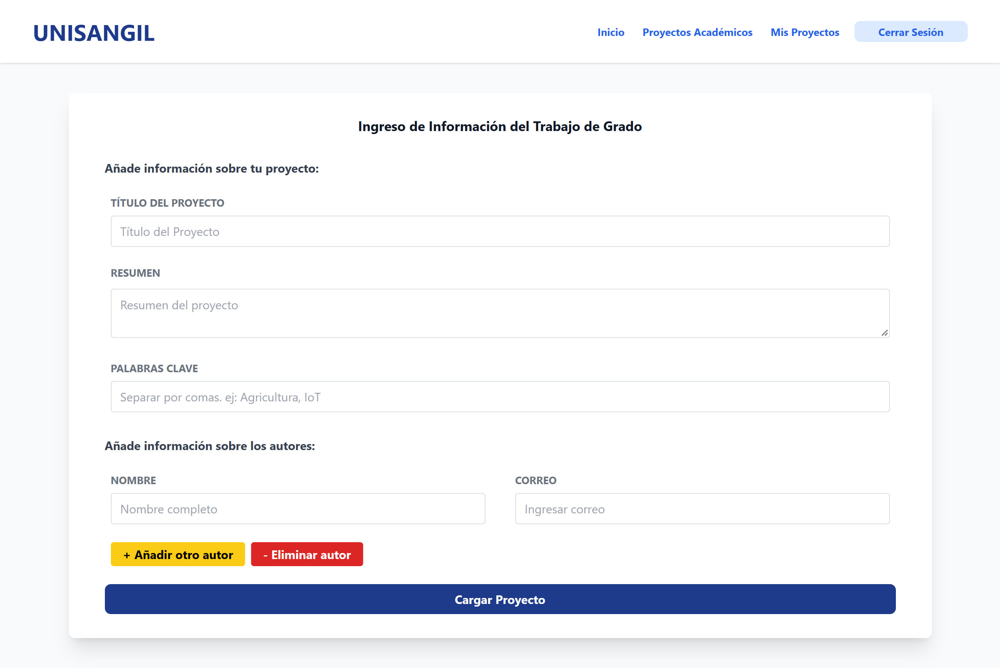
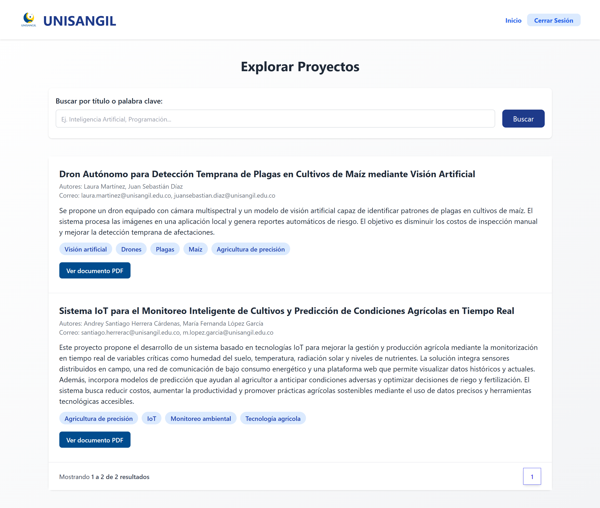
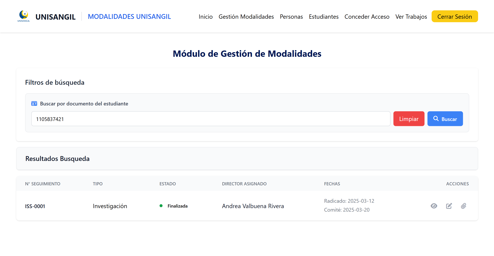
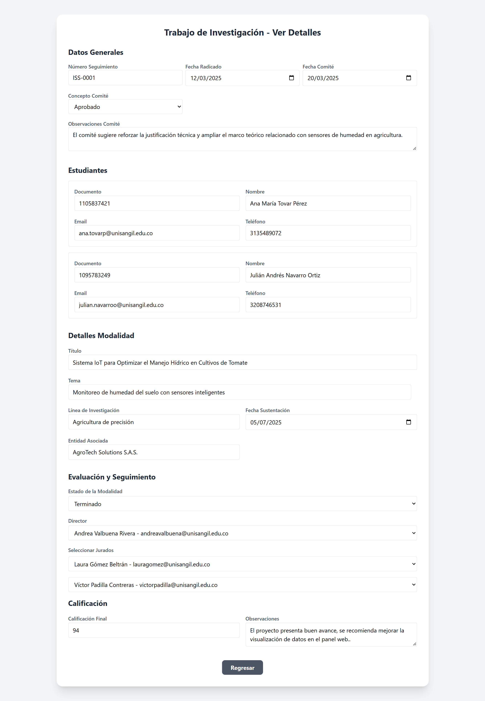
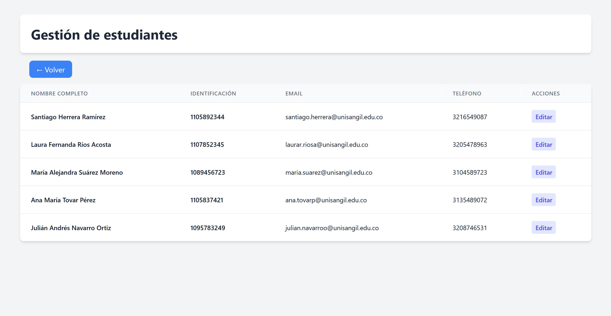
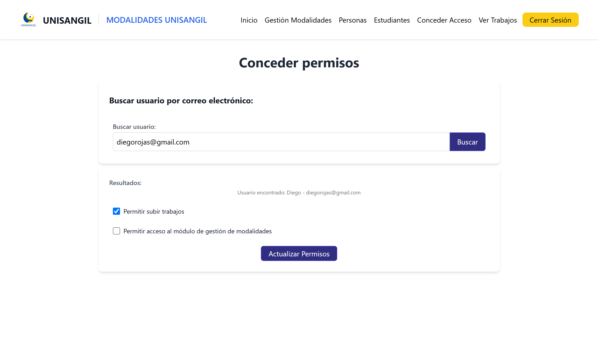

# Sistema web para la gestión de modalidades de grado: caso de estudio del Programa de Ingeniería de Sistemas

**Prototipo funcional de una aplicación web para gestionar y dar seguimiento a procesos de modalidades de grado.**

Ingeniería de Sistemas · Fundación Universitaria de San Gil (UNISANGIL)

---

## Sobre el proyecto

Este proyecto consiste en el desarrollo de un **prototipo funcional de una aplicación web para la gestión y seguimiento de procesos de modalidades de grado**.

El prototipo fue diseñado a partir del análisis del proceso de gestión de modalidades de grado y de las necesidades identificadas durante el proyecto. Su propósito es plantear una alternativa para organizar la información, aplicar reglas de negocio y facilitar el seguimiento de los procesos mediante una aplicación web.

---

## Problema y propuesta

Durante el análisis del proceso se identificó el uso de diferentes medios para gestionar y consultar la información relacionada con las modalidades de grado, incluyendo **hojas de cálculo, documentos y archivos almacenados de forma local**.

Esto podía dificultar:

- La consulta y organización de la información.
- El seguimiento del estado de los procesos.
- La actualización de los datos.
- La localización de documentos asociados. 

Como respuesta a estas necesidades, se desarrolló un **prototipo funcional de una aplicación web** que plantea una alternativa para estructurar el proceso mediante:

> **Datos → reglas de negocio → estados → validaciones → documentos → seguimiento**

El prototipo permite explorar cómo estas actividades podrían gestionarse desde un sistema centralizado, sin representar una implementación productiva del proceso.

---

## Funcionalidades principales

### Usuarios y acceso

- Registro e inicio de sesión.
- Autenticación mediante JWT.
- Protección de contraseñas mediante hash con bcrypt.
- Autorización de funcionalidades mediante permisos asociados al usuario.
- Protección CSRF en formularios.

### Gestión de procesos

El sistema permite gestionar las siguientes modalidades de grado:

- Investigación.
- Práctica Profesional.
- Diplomado en Profundización.
- Formación Coterminal.

Los procesos almacenan información de seguimiento y se relacionan con estudiantes, documentos, evaluaciones y datos específicos de cada modalidad.

### Trabajos de grado culminados

El sistema cuenta con un módulo para publicar y consultar trabajos de grado culminados. Los estudiantes pueden revisar esta información de manera pública para conocer trabajos previamente registrados.

Los usuarios que cuentan con los permisos correspondientes pueden cargar un trabajo de grado mediante un formulario que incluye:

- Título.
- Palabras clave.
- Descripción.
- Usuario responsable del registro.
- Archivo PDF del trabajo.

### Estados y concepto del comité

El estado del proceso y el concepto del comité son datos diferentes.

**Estados del proceso:**

- En proceso.
- Cancelada.
- Finalizada.

**Conceptos del comité:**

- Pendiente.
- Aprobado.
- Rechazado.

### Gestión documental

Permite asociar archivos a los procesos y almacenar documentos mediante **Cloudinary**. También permite cargar y publicar archivos PDF correspondientes a trabajos de grado culminados.

La interfaz de carga está orientada principalmente a documentos PDF y el acceso a la publicación está restringido a usuarios con los permisos correspondientes.

### Validaciones

El sistema implementa validaciones en diferentes flujos, entre ellas:

- Identificador de seguimiento autoincremental.
- Comprobación de correo duplicado durante el registro.
- Validación de datos de estudiantes y participantes.
- Validación del formato de fechas en determinados formularios.
- Restricciones relacionadas con el estado y el concepto del comité.
- Validación del rango de la calificación.
- Validación de la información requerida para publicar trabajos de grado.
- Restricción de carga de trabajos según los permisos del usuario.
- Validación del formato PDF para los archivos de trabajos de grado.

---

## Arquitectura

El proyecto utiliza una arquitectura basada en el patrón **MVC (Model-View-Controller)**:

```text
        ┌──────────────────┐
        │      Usuario     │
        └────────┬─────────┘
           │
           ▼
        ┌──────────────────┐
        │ Interfaz web Pug │
        └────────┬─────────┘
           │
           ▼
        ┌──────────────────┐
        │   Controllers    │
        └────────┬─────────┘
           │
           ▼
        ┌──────────────────┐
        │      Models      │
        │    Sequelize     │
        └────────┬─────────┘
           │
           ▼
        ┌──────────────────┐
        │      MySQL       │
        └──────────────────┘
```

La separación de responsabilidades permite mantener diferenciadas la presentación, la lógica de aplicación y el acceso a los datos.

---

## Tecnologías utilizadas

| Área | Tecnologías |
| --- | --- |
| **Backend** | Node.js, Express 5, Sequelize, JavaScript |
| **Base de datos** | MySQL, mysql2 |
| **Autenticación y protección** | JWT, bcrypt, middleware de autorización, CSRF |
| **Frontend** | Pug, HTML, CSS, Tailwind CSS |
| **Gestión documental** | Multer, Cloudinary |
| **Herramientas** | Git, GitHub, Postman |

---

## Autenticación y autorización

El sistema genera **JWT** para las sesiones y los transporta mediante una cookie.

El acceso a las funcionalidades se controla mediante middleware y permisos asociados al usuario.

```text
Usuario
   │
   ▼
Inicio de sesión
   │
   ▼
JWT en cookie
   │
   ▼
Middleware de autenticación
   │
   ▼
Comprobación de permisos
   │
   ├── Dirección de programa
   │
   ├── Explorar información sobre proyecto de grado culminados (Título, Descripción, PDF)
   │
   └── Permiso para subir información para trabajos de grado culminados
```

Los estudiantes pueden consultar públicamente los trabajos de grado culminados, mientras que la carga de nuevos registros está disponible únicamente para los usuarios autorizados. De igual manera, el acceso al módulo de gestion de modalidades esta restringido para usuarios normales.

---

## Reglas de negocio

La aplicación implementa validaciones relacionadas con:

- Estado del proceso.
- Concepto del comité.
- Fecha de sustentación.
- Calificación.
- Datos de estudiantes y participantes.
- Gestión de documentos.

La calificación utiliza un rango de **0 a 100** y determinadas operaciones dependen del estado y de la información registrada en el proceso.

---

## Flujo general

```text
Registro o inicio de sesión
  │
  ▼
Identificación y permisos del usuario
  │
  ▼
Consulta o gestión del proceso
  │
  ▼
Registro y validación de información
  │
  ▼
Actualización del estado
  │
  ▼
Gestión documental
  │
  ▼
Seguimiento del proceso
```

---

## Capturas del sistema

Las capturas se encuentran en la carpeta [`Imagenes/`](Imagenes/).

### Inicio de sesión



### Página de Inicio



### Gestión de procesos



### Gestión documental



### Carga de trabajos de grado



### Consulta pública de trabajos de grado



### Otras vistas del sistema

| Vista | Captura |
| --- | --- |
| Búsqueda de modalidades |  |
| Detalle de modalidad |  |
| Estudiantes |  |
| Consulta de usuarios |  |

---

## Decisiones técnicas

### MVC

Se utilizó el patrón **MVC** para separar las responsabilidades entre presentación, lógica de aplicación y acceso a datos.

### ORM

Se utilizó **Sequelize** para trabajar con MySQL mediante modelos y relaciones.

### Autenticación

Se implementó autenticación mediante **JWT almacenado en cookies**, junto con middleware para proteger las rutas y controlar permisos.

### Almacenamiento de documentos

Los archivos son procesados mediante **Multer** y almacenados utilizando **Cloudinary**. Este mecanismo se utiliza tanto para los documentos asociados a los procesos como para los archivos PDF de los trabajos de grado culminados.

### Publicación de trabajos de grado

El módulo permite registrar los metadatos de cada trabajo y almacenar el archivo PDF. Los usuarios autorizados pueden publicar la información y los estudiantes pueden consultarla públicamente.

### Validaciones

Las reglas de negocio se aplican durante los flujos de creación y actualización de los procesos para controlar información inválida o situaciones incompatibles con el flujo definido.

---

## Relación con mi interés en RPA

Este proyecto **no es una solución RPA** ni fue desarrollado específicamente con herramientas de automatización robótica de procesos.

Sin embargo, durante su desarrollo trabajé con conceptos transferibles al área de **RPA y automatización de procesos**:

- Análisis de procesos e identificación de tareas y reglas.
- Transformación de requisitos en reglas de negocio.
- Modelamiento de información.
- Validación de condiciones.
- Automatización de operaciones mediante software.
- Integración entre componentes.  

---

## Metodología de desarrollo

El proyecto fue desarrollado individualmente utilizando elementos de **Scrum**.

Se trabajó mediante:

- Sprints de dos semanas.
- Priorización de funcionalidades.
- Product Backlog.
- Entregas incrementales.
- Reuniones semanales de seguimiento.

El desarrollo se enfocó en construir progresivamente las funcionalidades necesarias para el prototipo.

---

## ¿Qué desarrollé?

Durante el proyecto participé directamente en:

- Análisis de requisitos.
- Diseño de la solución.
- Modelamiento de la base de datos.
- Desarrollo del backend.
- Desarrollo de funcionalidades CRUD.
- Implementación de autenticación.
- Implementación de autorización.
- Desarrollo de reglas de negocio.
- Validación de datos.
- Integración con almacenamiento de archivos.
- Desarrollo del módulo de carga y consulta pública de trabajos de grado culminados.
- Diseño de interfaces.
- Pruebas manuales de funcionalidades.
- Control de versiones con Git.

---

## Posibles mejoras

Entre las mejoras identificadas para una siguiente versión se encuentran:
 
- Reforzar algunas restricciones de integridad directamente en la base de datos.
- Incorporar pruebas automatizadas.
- Mejorar la separación de algunas reglas de negocio.
- Incorporar nuevos mecanismos de seguimiento y notificación.

---

## Contexto académico

| Campo | Información |
| --- | --- |
| **Programa** | Ingeniería de Sistemas |
| **Institución** | Fundación Universitaria de San Gil — UNISANGIL |
| **Tipo** | Proyecto de grado |
| **Desarrollo** | Individual |

---

## Sobre mí

Soy **Ingeniero de Sistemas** con interés en el desarrollo backend y la automatización de procesos.

### Tecnologías

**JavaScript · Node.js · Express.js · MySQL · SQL · Git/GitHub**

Actualmente estoy fortaleciendo mis conocimientos en **Python, automatización y RPA**, con interés en aplicar mis bases de desarrollo de software al análisis y automatización de procesos.


# gestion-modalidades-grado

